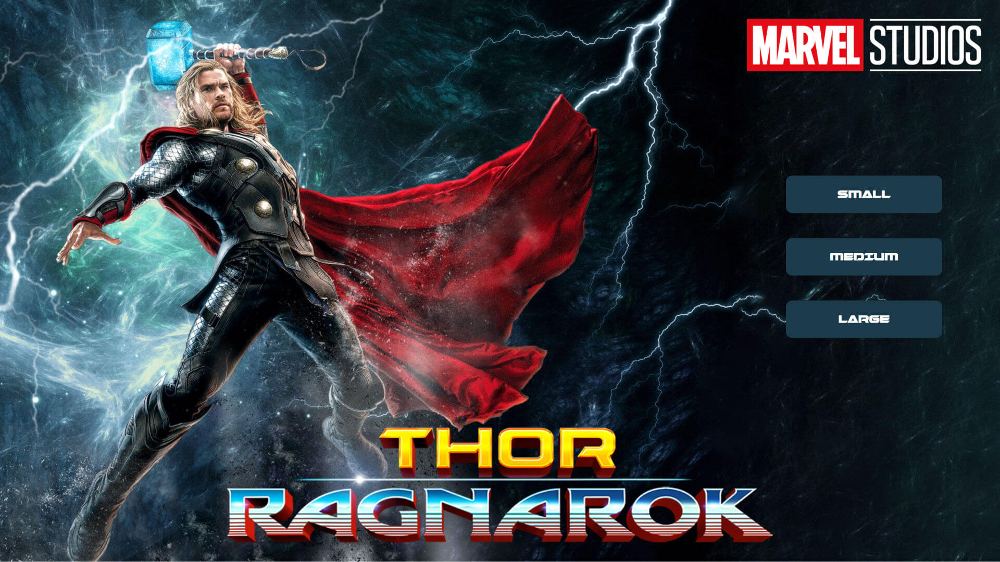

# College of Multimedia Opdracht HE-3

__Opdrachtomschrijving HE-3__

"Maak een trailerwebsite over een populaire film.
De website bevat een homepage en drie vervolgpagina's. 

Op homepage kan de gebruiker kiezen uit een kleine, medium of een large variant van de trailer.

De videobestanden moeten voldoen aan de volgende
technische specificaties:

* Groot: max. 720p en max. 5000 kbit/sec incl. audio
* Medium: max. 480p en max. 2500 kbit/sec incl. audio
* Klein: max. 360p en max. 1000 kbit/sec incl. audio

## Live demo
[Bekijk hier de live demo](https://cmm-front-end-developer-module-2-he-3.netlify.app)
